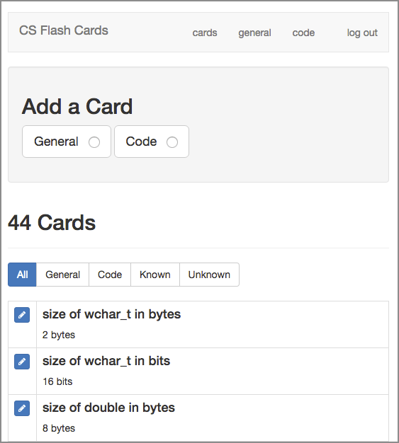
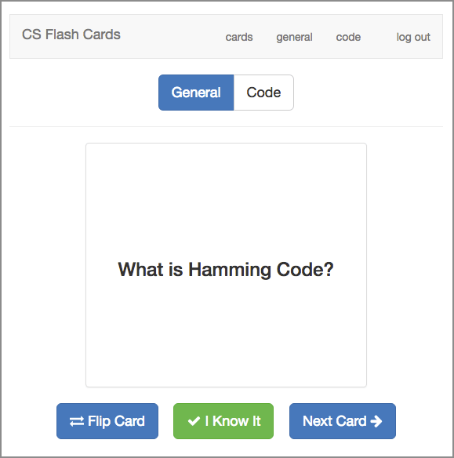
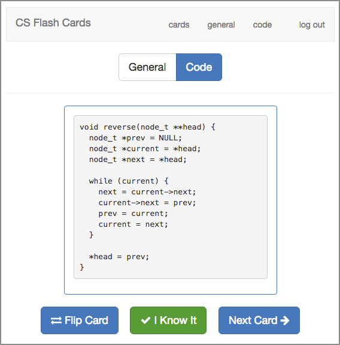

# Computer Science and ML Flash Cards

This is a little website I've put together to allow me to easily make flash cards and quiz myself for memorization of:

- general cs knowledge
    - vocabulary
    - definitions of processes
    - powers of 2
   
- code
    - data structures
    - algorithms
    - solving problems
    - bitwise operations
- ML
    - Ml interview questions
    - Different ML algos 
    - Questions about pipeline of ML
   

Will be able to use it on:
    - desktop
    - mobile (phone and tablet)

It uses:
- Python 3
- Flask
- SQLite
- Jinga

---


## Screenshots

UI for listing cards. From here you can add and edit cards.



---

The front of a General flash card.



---

The reverse (answer side) of a Code flash card.



## Important Note

The set included in this project (**cards-jwasham.db**) is not my full set, and is way too big already.

My set includes a lot of obscure info from books I’ve read, Python trivia, machine learning knowledge etc.

Please make your own set, and while you’re making them, only make cards for what you need to know. Otherwise, it gets out of hand. 

## How to convert to Anki or CSV

If you don't want to run a server, you can simply use Anki or a similar service/app. Use this script to convert from my sets (SQLite .db file), or yours, to CSV:

https://github.com/eyedol/tools/blob/master/anki_data_builder.py

Thanks [@eyedol](https://github.com/eyedol)


## How to run it on local host (Quick Guide)

*Provided by [@devyash](https://github.com/devyash) - devyashsanghai@gmail.com - Reach out to this contributor if you have trouble.*

1. Install dependencies:
  1. Install [Python ](https://www.python.org/download/releases/2.7/)
  2. Add python as environment variable [windows](http://stackoverflow.com/questions/3701646/how-to-add-to-the-pythonpath-in-windows-7)
  3. To install pip, securely download [get-pip.py](https://bootstrap.pypa.io/get-pip.py)
  4. Run ```python get-pip.py```in terminal
  5. Run ``` pip install -r requirements.txt``` in terminal after going to correct folder
2. Open flash_cards.py and uncomment the line 52-55 beginning from ``` @app.route('/initdb')```
3. Type ```python flash_cards.py``` 
4. Open localhost:5000/initdb
5. Login using id:USERNAME='admin', PASSWORD='default. 
6. Comment the line 52-55 in flash_cards.py

Every time you wish to run your db just open folder in terminal and run  ```python flash_cards.py```


*Happy learning!*

# CS-and-ML-Flash-Cards
